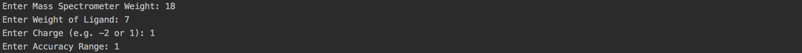
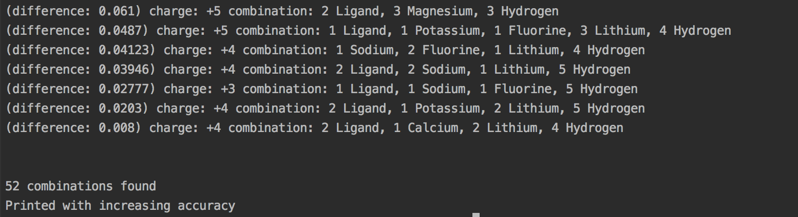

Python program to automate computation of molecular mass from mass spectrometer data for the Mason Group chemistry lab.

Introduction: This project was created to help interpret data from a mass spectrometer. The mass spectrometer outputs the ratio of mass of particle over charge and whether the particle is positively or negatively charged. Just from this single number, it is hard to determine what the structure of the particle is, so this program is useful for finding the best combination of subunits of the particle that correspond with the output of the mass spectrometer. The possible subunit combinations were programmed based on the specific chemistry research project.

Specifications of program: User inputs weight found by mass spectrometer, the weight of the ligand, the charge of the particle, and the accuracy range (e.g. an input of 1 will return combinations that will be +1 or -1 of the inputted mass spectrometer weight). 

Example:

